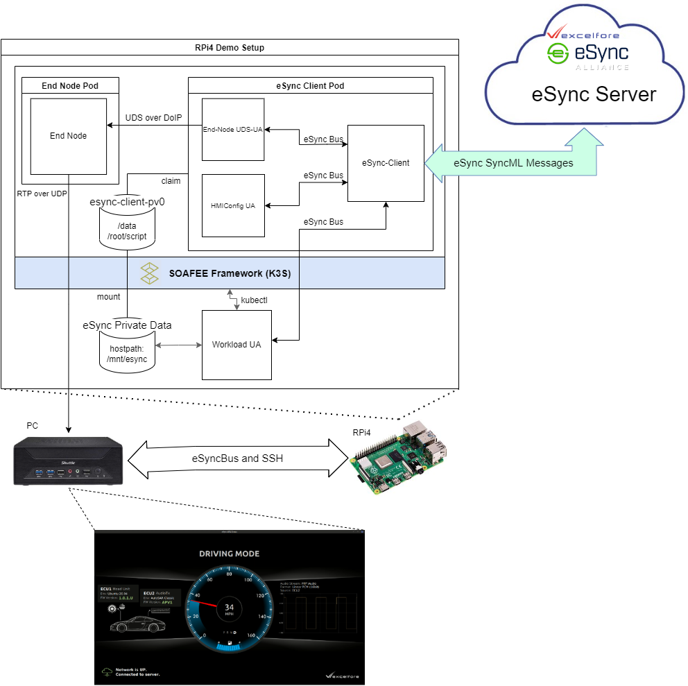

#### eSync OTA on SOAFEE Test Report


--------------------------------------------------------------------------------
#### Test Setup Description
##### Phase 1 Target platform: RaspberryPi4 running EWAOL BSP


##### Details
* `eSync client` is running in a container (`esync-client` pod)
* `end node` is running in a container (`end-node` pod)
* `workload agent` is running directly on linux on RPI4
* `workload agent(UA)` will connect to `eSync client` on the container to run any updates
* `workload agent(UA)` will update the containers
* `hmiagent` running on PC shows the visualization of the various updates performed
* `HMI Config UA` running in `esync-client` container can update the `HMI config file` of `HMI-agent` in `esync-client`
* `End-Node UDS-UA` running in `esync-client` container can update the `AudioTx` in `end-node` via `DOIP`

#### Pre-requisite Test Steps
1. Bootup RPI4 demo setup with the image `ewaol-image-docker-raspberrypi4-64`
2. On first boot, the system services will automatically provision eSync DMTree and In-Vehicle Component Certificates, as well as deploy the eSync-Client and End-Node Containers. Deployment takes some time, check that the pods are running before executing the test cases. Depending on the docker registry, it may take 30 to 50 minutes for the initial deployment. 
    ```
    $ kubectl get pods
    NAME                            READY   STATUS    RESTARTS   AGE
    svclb-esync-client-gpfrx        3/3     Running   0          23m
    esync-client-645f48bb65-458f2   1/1     Running   0          6m55s
    end-node-7ff98ccb98-lr5q6       1/1     Running   0          6m33s
    ```
3. Upload component packages to eSync Server <sup>[Note1]</sup>

#### Test Items
| No | Description                                                   | Test Steps                                                                                                                                                   | Expected Result                                                                       | Result |
|:---|:--------------------------------------------------------------|:-------------------------------------------------------------------------------------------------------------------------------------------------------------|:--------------------------------------------------------------------------------------|:-------|
| 1  | Connect to eSync server                                       | 1. Run `hmiagent` on the Linux PC<sup>[Note2]</sup>.<br>2. Check the network status on the display.<br>                                                      | Network is UP. Connection to server.                                                  | PASSED |
| 2  | Update `esync-client` deployment version to `latest` tag      | 1. Run Campaign to update `esync-client` using `CONTAINER-UPDATE-DEMO` package.<br>2. Check the container image version.<sup>[Note3]</sup><br>               | `esync-client` container image version is updated.                                    | PASSED |
| 3  | Downgrade `esync-client` container to `20.04-d623444` tag     | 1. Run Campaign to downgrade `esync-client` using `CONTAINER-UPDATE-DEMO`.<br>2. Check the container image version.<sup>[Note3]</sup><br>                    | `esync-client` container image version is downgraded.                                 | PASSED |
| 4  | Update `end-node` container to `latest` tag                   | 1. Run Campaign to update `end-node` using `CONTAINER-UPDATE-DEMO`.<br>2. Check the container image version.<sup>[Note3]</sup><br>                           | `end-node` container image version is updated.                                        | PASSED |
| 5  | Downgrade `end-node` container to `20.04-d623444` tag         | 1. Run Campaign to downgrade`end-node`using `CONTAINER-UPDATE-DEMO`.<br>2. Check the container image version.<sup>[Note3]</sup><br>                          | `end-node` container image version is downgraded.                                     | PASSED |
| 6  | Update `PKG` component running on `esync-client` container | 1. Run Campaign to update `HMI Config` component running on `esync-client` container using `CONFIG-UPDATE-DEMO-1.0.2.U`<br>2. Check the hmi-agent display       | HMI display changed to US locale. FW version field shows new version                  | PASSED |
| 7  | Downgrade `PKG` component running on `esync-client` container | 1. Run Campaign to update `HMI Config` component running on `esync-client` container using `CONFIG-UPDATE-DEMO-1.0.2.A`.<br>2. Check the hmi-agent display   | HMI display changed to Asia. FW version field shows new version                       | PASSED |
| 8  | Update `PKG` component running on `end-node` container        | 1. Run Campaign to update `AudioTx` component running on `end-node` container using `UDS-DOIP-UPDATE-DEMO-APV2`.<br>2. Check the hmi-agent display           | HMI display shows updated Audio waveform (smooth wave). FW version field shows new version. | PASSED |
| 9  | Downgrade `PKG` component running on `end-node` container     | 1. Run Campaign to downgrade `AudioTx` component running on `end-node` container using `UDS-DOIP-UPDATE-DEMO-APV1`.<br>2. Check the hmi-agent display        | HMI display shows updated Audio waveform (square wave). FW version field shows new version. | PASSED |
| 10 | Campaign with same container version                          | 1. Run Campaign with same version as the current `esync-client` container.<br>2. Check the package version.<br>                                              | `esync-client` container version is unchanged.                                        | PASSED |
| 11 | Valid hash, imageTag, and deploymentName                      | 1. Prepare component with specified hash, imageTag, and deploymentName  <sup>[Note2][Note3]</sup> <br>2.Run Campaign.<br>3. Check the campaign status          | Campaign status is succesful.                                                       | PASSED |
| 12 | Invalid hash, Valid imageTag, and deploymentName              | 1. Prepare component with specified hash, imageTag, and deploymentName  <sup>[Note2][Note3]</sup> <br>2.Run Campaign.<br>3. Check the campaign status          | Campaign status is failed.                                                          | PASSED |
| 13 | Valid hash, Invalid imageTag, and deploymentName              | 1. Prepare component with specified hash, imageTag, and deploymentName  <sup>[Note2][Note3]</sup> <br>2.Run Campaign.<br>3. Check the campaign status          | Campaign status is failed.                                                          | PASSED |
| 14 | No specified hash, imageTag, and deploymentName               | 1. Prepare component without hash, imageTag, and deploymentName  <sup>[Note2][Note3]</sup> <br>2.Run Campaign.<br>3. Check the campaign status                 | Campaign status is succesful.                                                       | PASSED |
| 15 | No specified hash, valid imageTag, and deploymentName         | 1. Prepare component without hash, and with specified imageTag, and deploymentName  <sup>[Note2][Note3]</sup> <br>2.Run Campaign.<br>3. Check the campaign status  | Campaign status is succesful.                                                   | PASSED |


##### <sup>[Note1]</sup> Steps to create the CONTAINER-UPDATE-DEMO Component Package
1. Prepare kubernetes yaml file to deploy. Refer to yaml files in `recipes-services/esync-k3s-deployment/files/kubeconfigs`
2. To update `esync-client` and `end-node` container to a specific `imageTag`, specify the tag in yaml file. Adding `imageTag:` field in the metadata as annotation will let workload agent verify imageTag. For example, to update to tag `20.04-d5f5356`, yaml file should be:
```yml
        apiVersion: apps/v1                                                             
        kind: Deployment                                                                
        metadata:                                                                       
            annotations:                                                                  
            ...                                       
            deploymentName: esync-client                                                
            container: esync-client                                                     
            imageName: excelforejp.com:5050/xl4esync/esync_batch/esync-client-soafee    
            imageTag:  20.04-d5f5356                                                    
            creationTimestamp: null                                                       
            labels:                                                                       
            io.kompose.service: esync-client                                            
            name: esync-client                                                            
        spec:                                                                           
            ...                                      
            spec:                                                                       
                containers:                                                               
                - image: excelforejp.com:5050/xl4esync/esync_batch/esync-client-soafee:20.04-d5f5356
```
3. Create a json file which lists the yaml files to apply. Refer to the schema `recipes-tools/python-libua/files/wa-schema.json`.
```json
[
	{ "confFilename":"esync-client-deployment.yaml", "hash":"<sha256 image digest/hash>"},
	{ "confFilename":"end-node-deployment.yaml", "hash":"<sha256 image digest/hash>"}
]
```
To get the image digest/hash from kubernetes
```bash
$ kubectl get pods esync-client-54c56bff44-lrqfs -o jsonpath="{..imageID}"
excelforejp.com:5050/xl4esync/esync_batch/esync-client-soafee@sha256:<sha256 image digest/hash>
```

4. Create a the component package payload (zip file) containing the kubernetes yaml files, as well as the json file list.
```bash
    $ zip update-list.zip update-list.json *.yaml
```

5. Create a manifest file for this component package. Udpate the versio field. Example:
```XML
        <!-- Manifest -->
        <xl4_pkg_update_manifest>
            <package>CONTAINER-UPDATE-DEMO</package>
            <name>CONTAINER-CONFIG</name>
            <type>/SDK/PY_AGENT</type>
            <payload>update-list.zip</payload>
            <version><_PACKAGE_VERSION_></version>
            <hardware>XL4-Gen6-MP-Beam</hardware>
        </xl4_pkg_update_manifest>
```    
6. Create the CONTAINER-UPDATE-DEMO component package
```bash
    $ zip CONTAINER-UPDATE-DEMO.zip manifest.xml update-list.zip 
```
7. Sign the component package. Please contact Excelfore Representative for the user certificate.
8. Upload the signed component package to the eSync server. For steps on how to upload components and deploy a campaign, please refer to the eSync Campaign Manager Guide document.

##### <sup>[Note2]</sup> Steps to run hmi-agent on Linux PC
Execute the following steps on a Linux PC which contains the SSH key authorized to access the eSync client service container.
1. Check that the default ssh client directory (ex: `$HOME/.ssh`) contains the ssh keys that match the ssh public key we copied to `recipes-services/esync-k3s-deployment/files/ssh-priv/authorized_keys` prior to build step.
2. Download the in-vehicle certificates that were automatically deployed to the RPI4 demo image.
```bash
    $ scp -r root@<RPI_IP_ADDRESS>:/mnt/esync/data/certs .
```
3. Execute `hmi-agent` on linux PC which contains the SSH key authorized to access the eSync client service container.
```bash
    $ <PATH_TO_BINARY>/hmi-otademo  \ 
                -k ./certs/hmi    \
                -c recipes-services/esync-k3s-deployment/files/scripts/device-config.conf  \
                -s " -p 30022 root@<RPI_IP_ADDRESS>"    \
                -r /root/scripts/device-config.conf    \
                -u tcp://<RPI_IP_ADDRESS>:31933
```
##### <sup>[Note3]</sup> Steps to check that K3S deployment image is updated
1. Connect to rpi via ssh
2. Execute `kubectl get deployment -o wide` and confirm the image tag is updated to the desired version.
```bash
$ kubectl get deployment -o wide
NAME           ...   CONTAINERS     IMAGES                                                                        
esync-client   ...   esync-client   excelforejp.com:5050/xl4esync/esync_batch/esync-client-soafee:20.04-d5f5356   
end-node       ...   end-node       excelforejp.com:5050/xl4esync/esync_batch/end-node-soafee:20.04-d5f5356       
``` 

##### <sup>[Note4]</sup> Running the workload agent
1. By default, the workload agent is started automatically by agent-soafee-demo.service. To check workload agent status, execute `systemctl status esync-workload-agent.service`
```bash
    $ systemctl status agent-soafee-demo.service
    ● agent-soafee-demo.service - Deploy Workload agent Demo to SOAFEE Framework (rpi)
         Loaded: loaded (/lib/systemd/system/agent-soafee-demo.service; enabled; vendor preset: enabled)
         Active: active (running) since Mon 2022-06-20 16:26:49 UTC; 1h 40min ago
       Main PID: 1642 (python3)
          Tasks: 14 (limit: 1905)
         Memory: 53.7M
         CGroup: /system.slice/agent-soafee-demo.service
                 ├─  1642 python3 /usr/bin/esyncrun.py
                 ├─  1803 python3 /usr/lib/python3.9/site-packages/pylibua//workloadagent.py -k /mnt/esync/data/certs//python-…
```
2. To stop running workload agent as a service, execute `systemctl stop agent-soafee-demo.service` 
3. To run workload agent from command line, execute `/usr/bin/esyncrun.py`
4. To configure arguments passed to workload agent, it can be configured in `/etc/esync/esyncrun.conf`
```
    [updateagent]
    enabled=ON
    exe=workloadagent.py
    prefix=/usr/bin/
    args=[
        "-k","/mnt/esync/data/certs//python-agent",
        "-c","/mnt/esync/data/sota//tmpl-py/cache",
        "-b","/mnt/esync/data/sota//tmpl-py/backup",
        "-t","/SDK/PY_AGENT",
        "-i","127.0.0.1",
        "-p","31933",
        "-u","root",
        "-s","30022",
        "-j","/usr/share/workloadagent//wa-schema.json",
        "-W","/usr/share/workloadagent/",
        "-m","0",
        "-r","30"
        ]
``` 
5. To show the logs, run
```
journalctl -f -u esync-workload-agent.service
```

##### Checking the logs of the workload agent

The workload agent is automatically 
